# Ejercicios-clase-2

Como se nos ha pedido, procedo a añadir los resultados a GitHub.

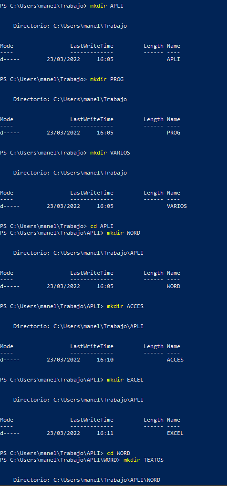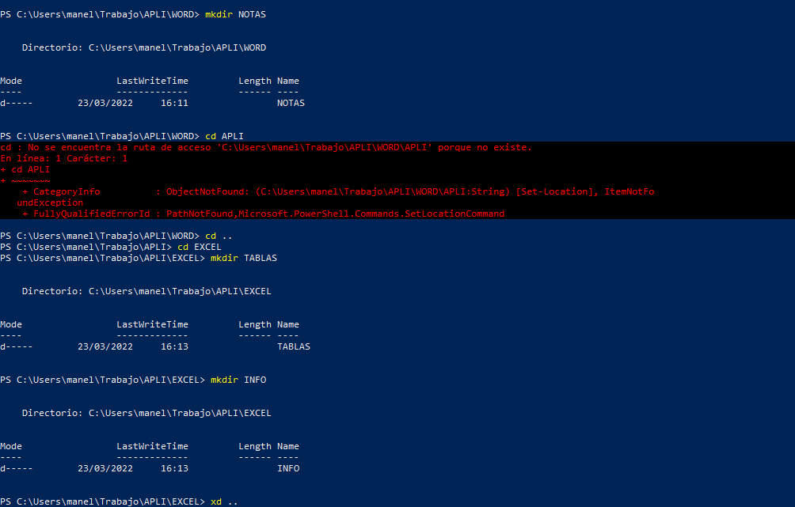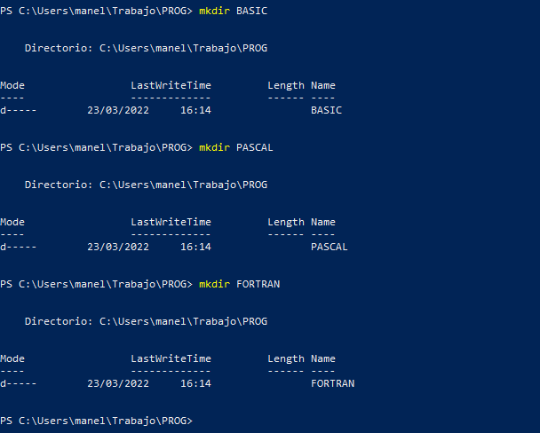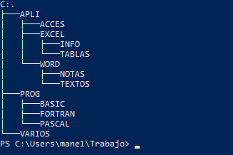

2.-

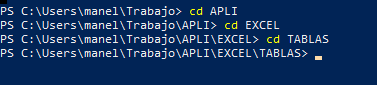

3.-

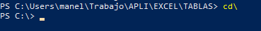

4.-

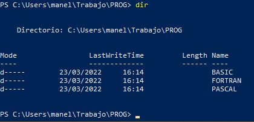

5.-

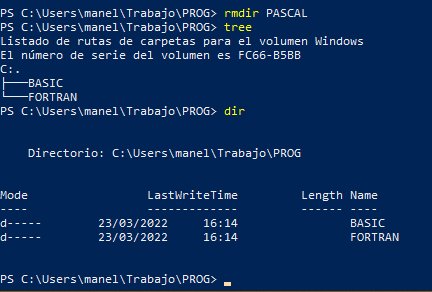

6.-

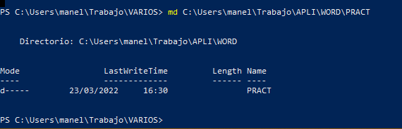

7.-

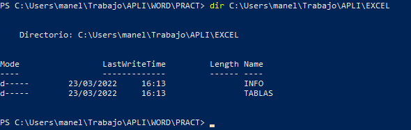

8.-

9.-

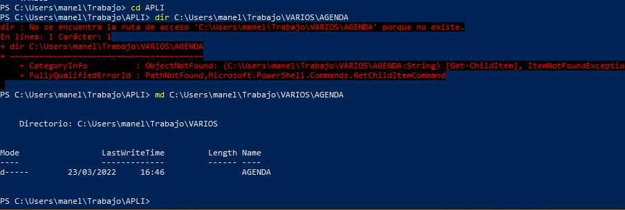

10.-

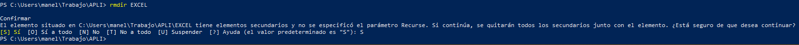

11.-

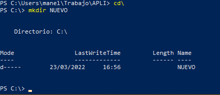

12.-

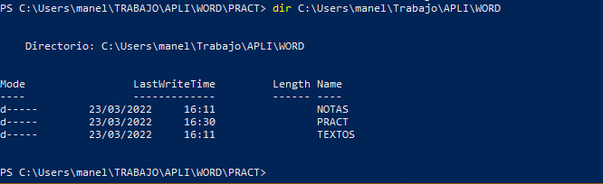

1,.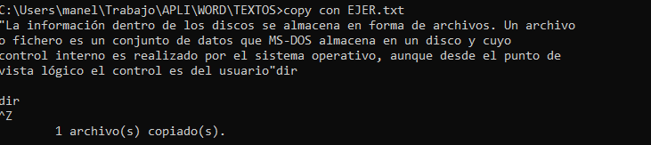

2.-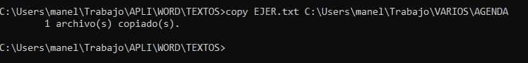

3.-

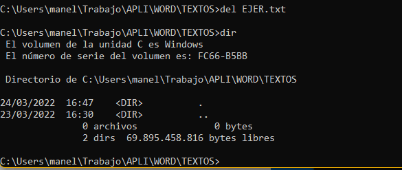

5.-

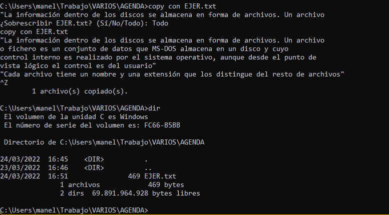

6.-

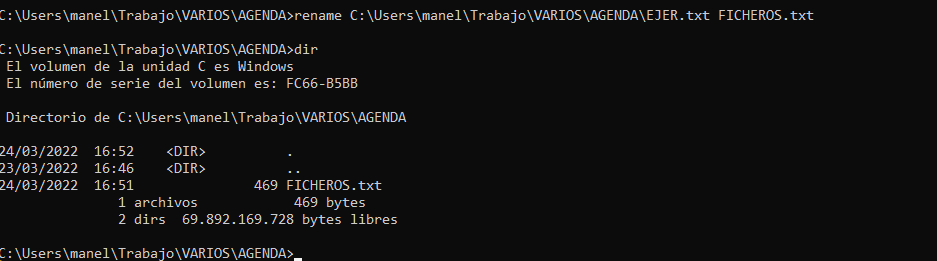

7.-

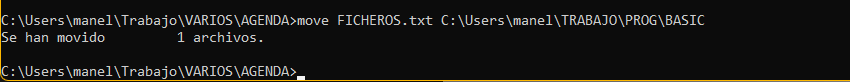

8.-

1.-

2.-

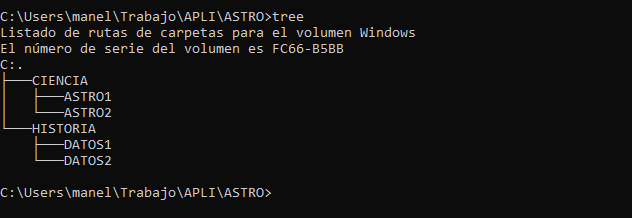

3.-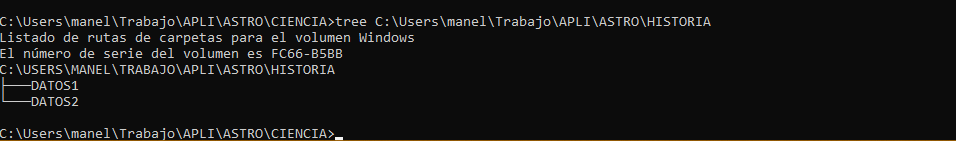

4.-

5.-

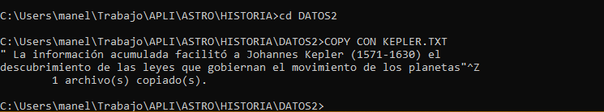

6.-

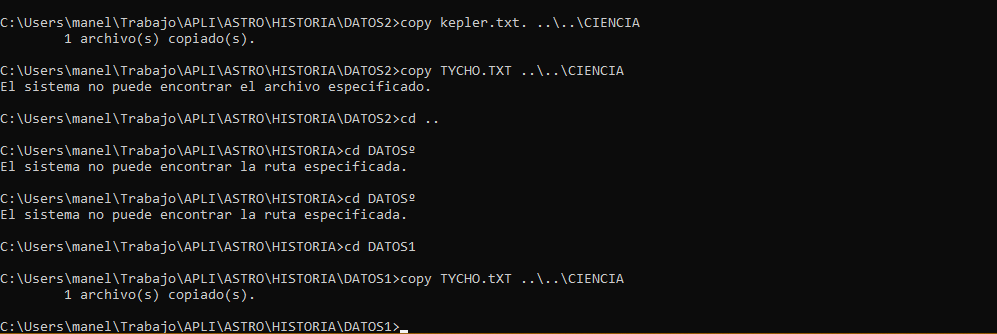

7.-

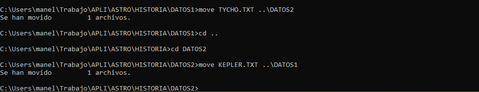

8.-

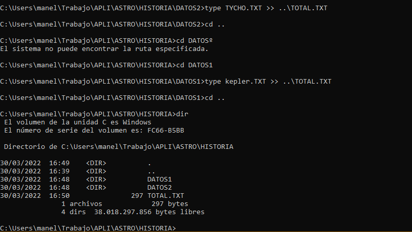

9.-

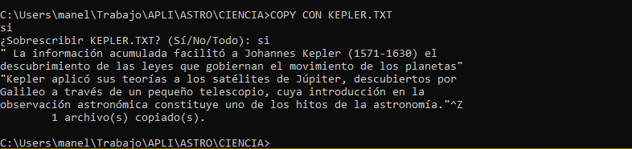

10.-

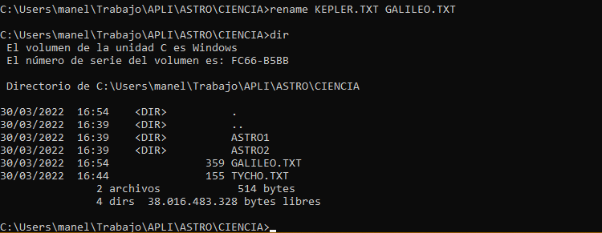

1.-

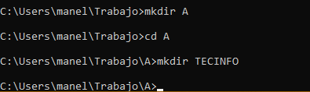

2.-

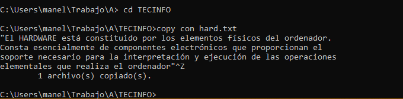

3.-

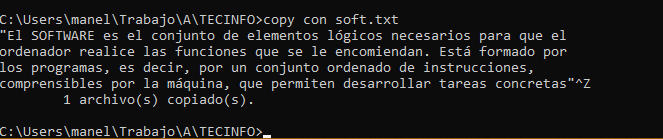

4.-

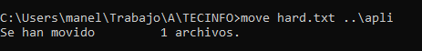

5.-
