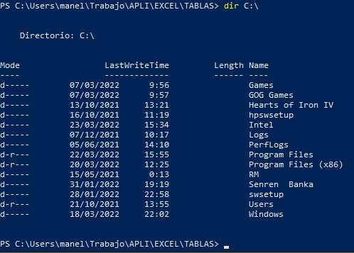
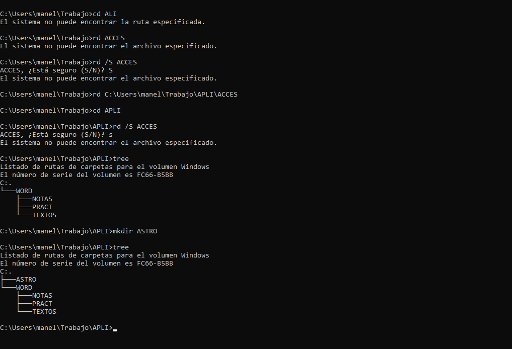
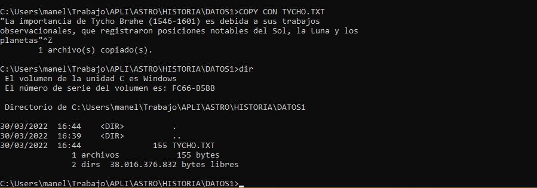
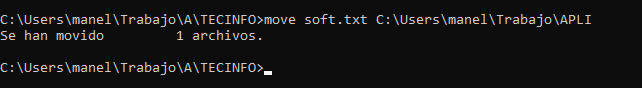

# Ejercicios-clase-2

Como se nos ha pedido, procedo a añadir los resultados a GitHub.

2.-

3.-

4.-

5.-

6.-

7.-

8.-

9.-

10.-

11.-

12.-

1,.

2.-

3.-

5.-

6.-

7.-

8.-

1.-

2.-

3.-

4.-

5.-

6.-

7.-

8.-

9.-

10.-

1.-

2.-

3.-

4.-

5.-
